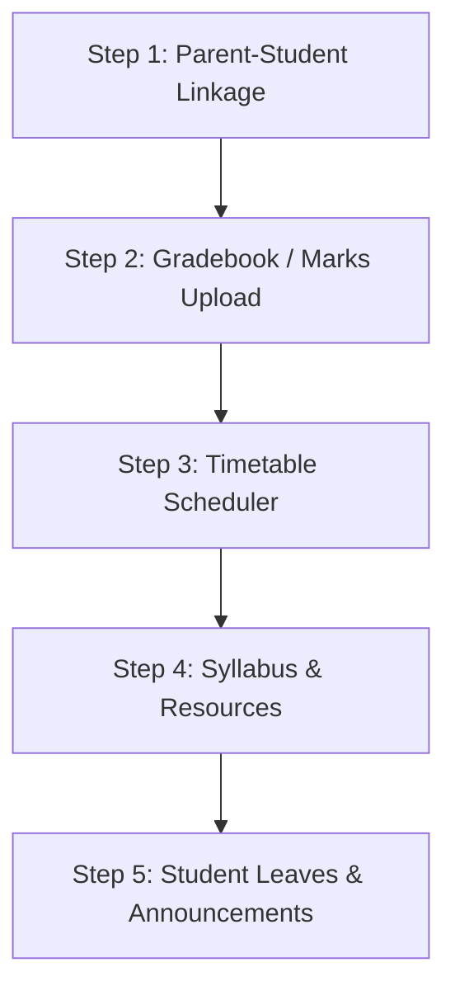

# Iqra School Management System (IHASS) — Developer's Guide

Welcome to the **Iqra Hadiqa Tul Atfal School (IHASS)** management system! This document is designed to help you quickly understand the current state of the application, review the features your friend built, and identify exactly where to start continuing development.

---

## 1. Project Architecture Overview

The application is structured as a standard modern MERN-stack project split into two primary components:
1. **`/backend`**: Node.js + Express REST API with MongoDB (Mongoose schemas), token authentication, and email dispatch services.
2. **`/frontend`**: React SPA built with Vite, Tailwind CSS v3, and Lucide React icons.

```
iqra-school-management-system/
├── backend/
│   ├── config/              # DB connection config
│   ├── controllers/         # Request handling & database logic
│   ├── middleware/          # Auth, error, and validation middlewares
│   ├── models/              # Mongoose data models
│   ├── routes/              # Express API endpoint declarations
│   ├── utils/               # Nodemailer email configuration & tokens
│   ├── server.js            # Main Express application entrypoint
│   └── check_db.js          # Helper script to audit database records
├── frontend/
│   ├── public/              # Static assets
│   ├── src/
│   │   ├── components/      # Reusable UI parts (Layout, Sidebar, Navbar, etc.)
│   │   ├── context/         # AuthContext state manager & Axios interceptors
│   │   ├── features/        # Feature-specific services and sub-modals
│   │   ├── pages/           # Pages rendering the dashboard screens
│   │   ├── services/        # Axios API wrapper (api.js)
│   │   ├── App.jsx          # Route mapping & portal access boundaries
│   │   └── main.jsx         # App mounting entrypoint
│   └── tailwind.config.js   # Tailored theme colors (navy & status palettes)
└── README.md                # Standard installation instructions
```

---

## 2. Features Already Built & Operational

Your friend did an amazing job establishing a clean, modular foundation for all the primary workflows:

### A. Authentication & Account Activation Flow
- **Multi-Role Support**: Supports four user roles: `admin`, `teacher`, `student`, and `parent`.
- **Teacher Activation**: Admins invite teachers by creating their profiles in the dashboard. The system generates a cryptographically secure token (`activationTokenHash`) and fires an email via Nodemailer. The teacher clicks the invitation link, goes to the `/activate/:token` route, and sets their password, which updates their status to active.
- **Session Interceptors**: The Axios instance automatically attaches a JWT token from `localStorage` to the headers. If a `401 Unauthorized` response is intercepted, it invalidates the session and redirects to the login screen.

### B. Student Profiles & Nested Fee Structure
- **Profiles**: Comprehensive student data including registration number, date of birth, contact information, class, and section mapping.
- **Nested Fee Tracking**: Unlike other models, fees are tracked directly within the `Student` schema under `feeInfo` to simplify lookup operations. It handles:
  - `amountDue` & `amountPaid`
  - `status` (`paid`, `pending`, `overdue`)
  - `history` array containing payment dates, amounts, and transaction methods.
- **Collection API**: Endpoints exist for recording payments (`POST /api/students/:id/fee-payment`) and defining fee bills (`PATCH /api/students/:id/fee-structure`).

### C. Academic Structure Mappings
- **Hierarchical Layout**: Models for `Class` (e.g., Grade 1), `Section` (linked to a `classTeacherId`), and `Subject`.
- **Assigned Faculty**: An `Assignment` model binds teachers to the class, section, and subject they teach, establishing clear ownership boundaries.

### D. Attendance Management
- **Student Attendance Logs**: The `Attendance` model logs a date and an array of student records with statuses (`present`, `absent`, `leave`, `late`).
- **Role Restrictions**: Teachers mark/edit attendance for their designated class section. Admins can search and audit attendance records school-wide.

### E. Financial Bookkeeping
- **Expenses**: Tracks general expenditures (utilities, rent, maintenance, stationery, assets) with filters and aggregate totals.
- **Faculty Payroll**: Tracks monthly salary payouts (`baseSalary`, `allowances`, `deductions`, `netSalary`) with constraints that prevent double payouts to the same teacher in a single month.

### F. Reports & Dashboard
- **Data aggregation**: The `/api/dashboard/summary` endpoint computes school statistics, Profit & Loss summaries, outstanding fees, and today's attendance percentages.
- **Visual Analytics**: The Reports view (`AdminReports.jsx`) renders interactive charts (using Recharts) of fee collection trends and lists fee defaulters.

### G. Student Self-Service Portal
- **Me Profile / Identity**: The `/api/students/me/profile` endpoint returns the logged-in student's information based on their email.
- **Academic & Financial Tracking**: The `/api/students/me/attendance`, `/api/students/me/subjects`, and `/api/students/me/fees` endpoints fetch active subjects, teachers, attendance logs, and payment histories.
- **Dynamic Portal & Routing**: Frontend routes for `/student/fees`, `/student/schedule`, and `/student/grades` are fully registered. The `StudentDashboard` and student sub-pages fetch and render this data live instead of static placeholders.

---

## 3. What is Missing or Required? (Your Roadmap to Continue)

Here is a list of features that are either not yet connected to the backend database or completely unbuilt. You can pick any of these to start coding:

### Option 1: Student Gradebook / Marksheet Management
* **Current State**: While the student dashboard references "GPA" and "Assessments", there are **no** backend models, controllers, or routes for exam results or academic grading.
* **What to do**:
  1. Create a `Grade` or `ExamResult` Mongoose model containing fields like `studentId`, `subjectId`, `examType` (midterm, final, monthly quiz), `marksObtained`, `totalMarks`, and `comments`.
  2. Write a `gradeController.js` and map its routes in `server.js` (e.g., `POST /api/grades` for teachers to upload grades, `GET /api/grades/student/:studentId` for viewing).
  3. Create an academic performance panel on the Admin and Teacher portals to record marks, and display them on the Student dashboard.

### Option 2: Syllabus and Class Resource Uploads
* **Current State**: There is no feature allowing teachers to upload course outlines, study materials, or weekly syllabus items.
* **What to do**:
  1. Create a `Resource` model referencing `classId`, `subjectId`, `title`, `description`, and a `fileUrl` (or web link).
  2. Build a frontend feature in the Teacher portal to add resources.
  3. Add a "Resources" tab in the Student portal where students can download PDFs or open links uploaded by their teachers.

### Option 3: Student Leave Requests (from Parents/Students)
* **Current State**: `LeaveRequest` currently only supports teachers requesting time off from the school Admin. Student leaves must be handled manually or marked directly in attendance.
* **What to do**:
  1. Extend the `LeaveRequest` schema or create a `StudentLeave` model to record student IDs, leave dates, reasons, and approval status.
  2. Connect the portal so parents/students can apply for leave.
  3. Allow class teachers to approve/reject student leaves, which can automatically mark their status in attendance logs.

### Option 4: Parent-Student Linkage Mapping
* **Current State**: A `parent` role exists in the `User` schema, but there is no association in the database connecting parent accounts to their respective children.
* **What to do**:
  1. Add a `parentEmail` or `parentUserId` reference in the `Student` schema.
  2. Modify auth flow or student controller to allow users with the `parent` role to query linked students' details.

### Option 5: School Noticeboard / Announcement System
* **Current State**: School-wide notifications (e.g., holidays, fee alerts, exam schedules) must be shared offline or manually.
* **What to do**:
  1. Build an `Announcement` model referencing `title`, `content`, `audience` (all, teachers, students), and `expiryDate`.
  2. Allow Admins to post notices and render a global banner or alert widget on dashboards.

### Option 6: Class Timetable / Weekly Schedule Scheduler
* **Current State**: Students can see their subjects, but there is no hourly timetable (e.g., Monday 9:00 AM - 9:45 AM: Mathematics).
* **What to do**:
  1. Create a `Timetable` schema mapping `classId`, `sectionId`, `dayOfWeek`, `subjectId`, `startTime`, and `endTime`.
  2. Expose a calendar/grid layout in the Student portal under "My Schedule" instead of a flat list of subjects.

---

## 4. Step-by-Step Implementation Roadmap

If you want to continue systematically, here is the recommended plan:



### Phase 1: Parent-Student Association & Portal Integration
1. **Database Schema Update**: Add `parentEmail` to the `Student` model.
2. **Controller Update**: Enhance `getMyProfile` to handle queries by parent accounts looking up their children.
3. **Frontend UI Update**: Display child select dropdown on parent dashboards.

### Phase 2: Gradebook & Marksheet
1. **Model creation**: Build the `Grade` model linking `Student`, `Subject`, and exam types.
2. **Teacher Portal**: Add a form under `TeacherDashboard` allowing grades input for class section students.
3. **Student Portal**: Swap mock list in `StudentGrades.jsx` with real data fetched from `GET /api/grades/me`.

### Phase 3: Weekly Timetable/Schedule
1. **Model creation**: Implement `Timetable` schema.
2. **Admin Portal**: Add a scheduler tool in Academic management to configure class timetables.
3. **Student Portal**: Render weekly timetable calendar view in `StudentSchedule.jsx`.

---

## 5. How to Start the App Locally

To start working, run the backend and frontend in separate terminal windows:

### Setup Backend:
1. Navigate to `/backend`.
2. Check your `.env` configuration. You need a running MongoDB database. Ensure you configure:
   ```env
   PORT=5000
   MONGO_URI=mongodb://localhost:27017/iqra_school_management
   JWT_SECRET=your_secret_jwt_key
   EMAIL_HOST=smtp.gmail.com
   EMAIL_PORT=587
   EMAIL_USER=your_email@gmail.com
   EMAIL_APP_PASSWORD=your_app_specific_password
   ```
3. Run `npm install` and then `npm run dev` to boot the hot-reloading server.

### Setup Frontend:
1. Navigate to `/frontend`.
2. Check your `.env` configuration:
   ```env
   VITE_API_URL=http://localhost:5000/api
   ```
3. Run `npm install` and then `npm run dev` to start the local Vite development server. Open `http://localhost:5173`.

### Auditing Database:
- Run `node backend/get_users.js` inside the `/backend` folder to print out all registered users, their roles, and automatically pre-generate valid JWT tokens that you can insert into your API requests (e.g., in Postman) for debugging.
- Run `node backend/check_db.js` to see a quick report of existing classes, sections, and assignments.

---

*Tip: To start coding right away, we suggest opening [App.jsx](file:///e:/projects/iqra-school-management-system/frontend/src/App.jsx) and tracing the student portal routes, then implementing Option 1 (Gradebook / Marksheet)!*

